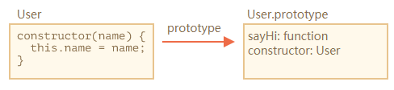
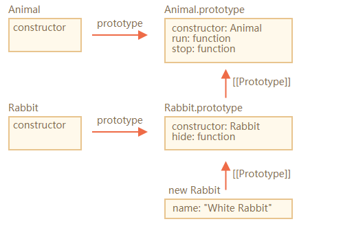

# 类和原型

## 什么是原型

“基于原型”的编程看起来更为提倡程序员去关注一系列**对象实例**的行为，而后才去关心如何将这些对象，划分到最近的使用方式相似的原型对象，而不是将它们分成类。

“基于类”的编程提倡使用一个关注分类和类之间关系开发模型。在这些类语言中，总是**先有类**，再从类去实例化一个对象。类与类之间又可能会形成继承、组合等关系。类又往往与语言的类型系统整合，形成一定编译时的能力。

基于原型和基于类都能够满足基本的复用和抽象需求，但是适用的场景不太相同。

原型系统的“复制操作”有两种实现思路：

- 一个是并不真的去复制一个对象，而是使得新对象持有一个原型的引用；
- 另一个是切实地复制对象，从此两个对象再无关联。

历史上的基于原型语言因此产生了两个流派，显然，JavaScript选择了前一种方式。

## JavaScript的原型

如果我们抛开JavaScript用于模拟Java类的复杂语法设施（如new、Function Object、函数的prototype属性等），**原型系统可以说相当简单**，我们可以用两条概况：

1. 如果所有对象都有私有字段[[prototype]]，就是对象的原型；
2. 读一个属性，如果对象本身没有，则会继续访问对象的原型，直到原型为空或者找到为止。

这个模型在ES的各个历史版本中并没有很大改变，但从**ES6开始，JavaScript提供了一系列内置函数，以便更为直接地访问操纵原型。**三个方法分别为：

- **Object.create** 根据指定的原型创建新对象，原型可以是null；
- **Object.getPrototypeOf** 获得一个对象的原型，内部 `[[Prototype]]` 属性的值；
- **Object.setPrototypeOf** 设置一个对象的原型。

利用这三个方法，我们完全可以抛开类的思维，利用原型来实现抽象和复用。下面代码展示了用原型来抽象猫和虎的例子。

```js
let cat = {
  say() {
  	console.log("meow~");
  },
  jump() {
  	console.log("jump");
  }
}

let tiger = Object.create(cat, {
  say: {
 		value: function(){
   		console.log('roar!');
    },
    writable: true,
    enumerable: true,
    configurable: true
  }
})

let anotherCat = Object.create(cat);
anotherCat.say();

let anotherTiger = Object.create(tiger);
anotherTiger.say();
```

## 早期版本中的类与原型

在早期JavaScript版本中，“类”的定义是一个**私有属性[[class]]**，语言标准为内置类型如Number、String、Date等指定了[[class]]属性，以表示它们的类。语言使用者唯一可以访问[[class]]属性的方式是Object.prototype.toString()。

```js
let o = new Object();
Object.prototype.toString(o); // [object Object]
```

因此，在ES3和之前，JS中类的概念是相当弱的，它仅仅是运行时的一个字符串属性。

在ES5开始，[[class]]私有属性被**Symbol.toStringTag**代替，Object.prototype.toString的意义从命名上不再跟class相关，我们甚至可以自定义Object.prototype.toString行为，以下代码展示了使用Symbol.toStringTag来自定义Object.prototype.toString行为：

```js
let o = {[Symbol.toStringTag]: 'MyObject'};
console.log(o + ""); // [object MyObject]
```

但是，考虑到JavaScript语法中跟Java相似的部分，我们对类的讨论不能用“**new运算**是针对构造器对象，而不是类”来试图回避。

所以，我们仍然要把new理解为JavaScript面向对象的一部分，下面来看一下new操作具体做了哪些事情。

new运算符接受一个构造器和一组调用参数，实际上做了几件事：

- 以构造器的prototype属性（注意与私有字段[[prototype]]的区分）为原型，创建新对象；
- 将this和调用参数传给构造器，执行；
- 如果构造器返回的是对象，则返回，否则返回第一步创建的对象。

new这样的行为，试图让函数对象在语法上跟类变得相似，但是，它客观上提供了两种方式，一是在构造器中添加属性，二是在构造器的prototype属性上添加属性。

```js
// 直接在构造器中修改this，给this添加属性
function c1(){
  this.p1 = 1;
  this.p2 = function(){
  	console.log(this.p1);
  }
}

let o1 = new c1();
o1.p2() // 1
```

```js
// 修改构造器的prototype属性指向的对象
function c2(){}
c2.prototype.p1 = 1;
c2.prototype.p2 = function(){
  console.log(this.p1);
}

let o2 = new c2();
o2.p2(); // 1
```

没有Object.create、Object.setPrototypeOf的早期版本中，new运算是唯一一个可以指定[[prototype]]的方法（当时的mozilla提供了私有属性\__proto__，但是多数环境并不支持），所以当时已经有人试图用它来替代后来的Object.create，我们甚至可以用它来实现一个Object.create的不完整polyfill：

```js
Object.create = function(prototype) {
  let cls = function(){}
  cls.prototype = prototype;
  return new cls();
}
```

这个函数无法做到与原生的Object.create一致，一个是不支持第二个参数，另一个是不支持null作为原型，所以放到今天意义已经不大了。

## ES6中的类

好在ES6中加入了新特性class，new和function搭配的怪异行为终于可以退休了（虽然运行时没有改变），在任何场景，我都推荐使用ES6的语法来定义类，而令function回归原本的函数语义。

ES6中引入了class关键字，并且在标准中删除了所有[[class]]相关的私有属性描述，类的概念正式从属性升级成语言的基础设施。从此，基于类的编程方式成为了JavaScript的官方编程范式。

```js
class Rectangle {
  constructor(height, width){
  	this.height = height;
   	this.width = width;
  }
  // Getter
  get area(){
  	return this.calcArea();
  }
  // Method
  calcArea(){
  	return this.height * this.width;
  }
}
```

类的写法实际上也是由原型运行时来承载的，**逻辑上JavaScript认为每个类是有共同原型的一组对象，类中定义的方法和属性则会被写在原型对象之上。**

此外，最重要的是，类提供了继承能力。

```js
class Animal {
  constructor(name){
  	this.name = name;
  }
  speak(){
 		console.log(this.name + ` makes a noise.`);
  }
}

class Dog extends Animal{
  constructor(name){
  	super(name);
  }
  speak(){
  	console.log(this.name + ` barks.`);
  }
}

let d = new Dog('Mitzie');
d.speak(); // Mitizie barks.
```

一种激进的观点认为，class关键字和箭头函数运算符完全可以代替旧的function关键字，它更明确区分了定义函数和定义类两种意图。

## 理解类

- 类是一种函数

```js
class User {
  constructor(name) { this.name = name; }
  sayHi() { alert(this.name); }
}

// 佐证：User 是一个函数
alert(typeof User); // function
```

class User {...} 构造器内部做了什么？

1. 创建一个以User名称的函数，这是类声明的结果，函数代码来源于constructor方法；
2. 存储所有的方法，例如User.prototype的sayHi。

然后，对于新的对象，当我们调用方法时，它取自于原型，所以new User对象可以访问类的方法。

可以将class User声明的结果理解为：



```js
class Student extends User{}
let s = new Student();
Object.getPrototypeOf(s) == Student.prototype
```



- 类不仅仅是语法糖

它有以下不同之处：

1. 不像普通函数，调用类构造器的时候必须使用new关键字：

```js
class User {
  constructor(){}
}

alert(typeof User); // function
User(); / Error
```

2. 类方法不可枚举
3. 类默认使用 ```use strict``` 。在构造器的所有方法默认使用严格模式。

## 总结

现在，你可以在JavaScript中自由选择使用原型体系还是类体系。

---

来自：重学前端


