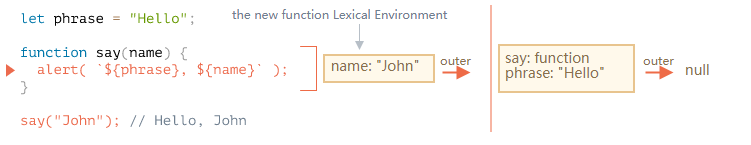

# 词法环境

在JavaScript中，每个运行的函数、代码块或整个程序，都有一个称为**词法环境**的关联对象。

词法环境由对象两部分组成：

- **环境记录**——一个把所有**局部变量作为其属性**（包括一些额外的信息，比如this值）的对象。
- **外部词法环境的引用**——通常是嵌套当前代码（花括号之外）之外代码的词法环境，它保存在函数的[[Environment]]属性。

所以，变量只是环境记录这个特殊内部对象的属性。访问或修改变量意味着访问或修改词法环境的一个属性。

## 内部和外部词法环境

```js
let phrase = "Hello";
function say(name) {
  alert(`${phrase}, ${name}`);
}
```

在函数调用中，say()用到了一个外部变量，它的原理是什么？

首先，当函数运行时，会自动创建一个新的函数词法环境。这是一条对于所有函数通用的规则。这个词法环境用于存储调用的局部变量和参数。



在这个函数的执行中，有两个词法环境：内部一个和外部一个：

- 内部词法环境对应于say的当前执行。它有一个单独的变量：name，它是一个函数参数。我们执行say(“John”)，那么name的值为“John”。
- 它的外部词法环境就是全局词法环境。

当代码试图访问一个变量时——它首先会在内部词法环境中进行搜索，然后是外部环境，然后是更外部的环境，指导链的末尾。

在严格模式下，变量未定义会导致错误。在非严格模式下，为了向后兼容，给未定义的变量赋值会创建一个全局变量。

注意：

> 函数访问外部变量；它使用的是最新的值。

> 一次调用，一个词法环境，每次函数运行都会创建一个新的函数词法环境。如果一个函数被调用多次，那么每次调用也会创建一个拥有指定局部变量和参数的词法环境。

> 不管是使用函数声明或是函数表达式创建的函数都没关系，所有的函数都有[[Environment]]属性，该属性引用着所创建的词法环境。新的嵌套函数同样也拥有这个属性。

## 代码块和循环

对于{...}代码块，词法环境同样也是存在的。

```js
let phrase = "Hello";
if (true) {
  let user = "John";
  alert(`$(phrase), $(user)`);
}
alert(user); // Error
```

对于循环而言，每次迭代都有独立的词法环境。

```js
for (let i = 0; i < 10; i++){
  // 每次循环都有其自身词法环境
  // {i, value}
}
alert(i); // 错误，没有该变量
```

这实际上是个意外，因为let i看起来好像是{...}外，但事实上，每一次循环执行都有自己的词法环境，其中包含着i。

在循环结束后，i是访问不到的。

## 垃圾收集

- 通常，在函数运行后词法环境会被清理。

```js
function f(){
  let value1 = 123;
  let value2 = 456;
}
f();
```

这里的两个值都是词法环境的属性。但是f()执行完后，该词法环境变成不可达，因此它在内存中已被清理。

- 但是如果有一个嵌套函数在f结束后仍可达，那么它的[[Environment]]引用会继续保持着外部词法环境存在：

```js
function f(){
  let value = 123;
  function g() {alert(value);}
  return g;
}
let g = f(); // g是可达的，并且将其外部词法环境保持在内存中
```

- 词法环境对象在变成不可达时会被清理：当没有嵌套函数引用时，在下面的代码中，在g变得不可达后，value会被从内存中清除：

```js
function f(){
  let value = 123;
  function g() {alert(value);}
  return g;
}
let g = f(); 

g = null; // 在内存中被清理
```

---

参考：JavaScript.Info