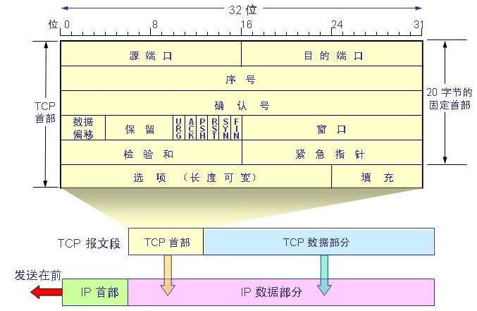
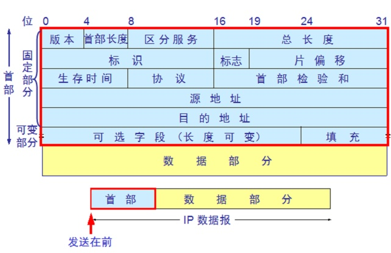
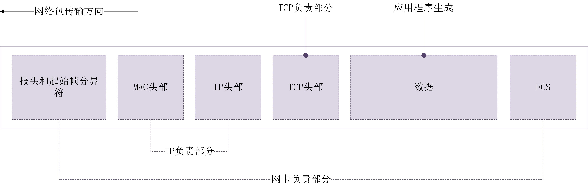

# OSI模型

## 7 应用层

这一层负责确定通信对象，并确保有足够的资源用于通信。

## 6 表示层

处理用户信息的表示问题，如编码、数据格式转换和加密解密等。这一层，我们看到界面与二进制相互转化，就是我们的语言和机器语言间的转化。这一层根据不同的应用目的将数据处理为不同的格式。**表现出来就是我们看到的各种各样的文件拓展名。**

## 5 会话层

**会话层**，负责建立、维护、控制会话，区分不同的会话，以及提供单工、半双工、全双工三种通信模式的服务。它管理主机之间的会话进程，即**负责建立、管理、终止进程之间的会话**。会话层还利用在数据中插入检验点来实现数据的同步。

## 4 传输层

传输层，负责分割、组合数据，实现端到端的逻辑连接。数据在上三层是整体的，到了这一层开始被分割，这一层被分割后的数据被称为段（TCP）或数据报（UDP）。

## 3 网络层

网络层，负责管理网络地址、定位设备、决定路由。IP地址和路由器就是工作在这一层。上层的数据段在这一层被分割，封装后叫做包。

> 路由器的网卡具有IP地址和MAC地址。

## 2 数据链路层

数据链路层，负责准备物理传输，CRC校验，错误通知，网络拓扑，流控等。MAC地址和交换机工作在这一层。上层传下来的包在这一层被分割封装后叫做帧。在不可靠的物理介质上提供可靠的传输。

这层通过又被分为介质访问控制（MAC）和逻辑链路控制（LLC）两个子层。

MAC子层的主要任务是解决共享型网络中多用户对信道竞争的问题，完成网络介质的访问控制；

LLC子层的主要任务是建立和维护网络连接，执行差错校验、流量控制和链路控制。

> 注意，交换机本身不具有MAC地址。它由许多网线接口和电路组成的端口，一个端口就相当于计算机的一块网卡，功能也是相当的，但是不具有MAC地址。

网卡会核对接收到的包的MAC地址是不是发送给自己的，如果不是则直接丢弃，而交换机的端口不核对MAC地址，而是直接把包存储在缓冲区。它的工作是通过MAC地址和端口组成的转发表。

## 1 物理层

实现相邻计算机节点之间的比特流透明传输。

---

参考：[riluozhiyue](https://blog.51cto.com/frankch)