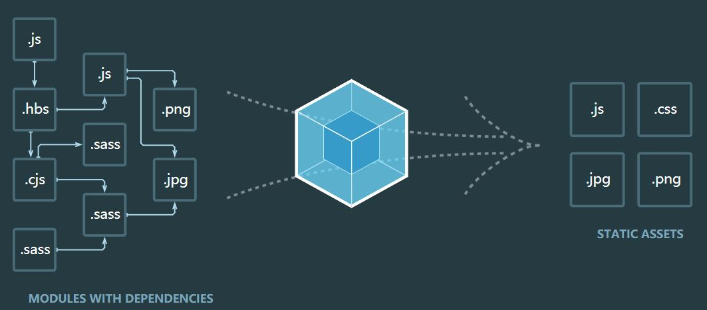

# Webpack

## 概念

webpack是一个现代JavaScript应用程序的静态模块打包器。当webpack处理程序时，他会递归地构建一个依赖关系图，其中包含应用程序需要的每个模块，然后将所有这些模块打包成一个或多个bundle。



核心概念：

- 入口
- 输出
- loader
- plugins

### 入口

入口起点指示webpack应该使用哪个模块，来作为构建其内部的依赖图的开始。进入入口后，webpack会找出那些模块和库是入口起点直接或间接依赖的。

每个依赖图随即被处理，最后输出到称之为bundles的文件中。

一个入口配置的最简单的例子：

```js
// webpack.config.js

module.exports = {
    entry: './path/to/my/entry/file.js'
}
```

### 出口

output属性告诉webpack在哪里输出它锁创建的bundles，以及如何命名这些文件，默认值为./dist。基本上，整个应用程序结构，都会被编译到你指定的输出路径的文件夹中。你可以通过在配置中指定一个output字段，来配置这些处理过程。

```js
// webpack.config.js

// 这是一个Node.js核心模块，用于操作文件路径
const path = reqire('path');

module.exports = {
    entry: './path/to/my/entry/file.js',
    output: {
        // 指定bundle生成路径
        path: path.resolve(__dirname, 'dist'),
        // 指定bundle名称
        filename: 'my-first-webpack.bundle.js'
    }
}
```

### loader

loader让webpack能够去处理那些非JavaScript文件（webpack本身只理解JavaScript）。loader可以将所有类型的文件转换为webpack能够处理的有效模块，然后你就可以利用webpack的打包能力，对它们进行处理。

本质上，webpack loader将所有类型的文件，转换为应用程序的依赖图可以直接应用的模块。

> 注意，loader能够import 导入任何类型的模块（例如.css文件），这是webpack特有的功能，其他打包程序或任务执行器可能不支持。

在更高层面，在webpack配置中loader有两个目标：

1. test属性，用于表示出被对应的loader进行转换的某个或某些文件
2. use属性，表示进行转换时，应该使用哪个loader

```js
const path = require('path');

const config = {
  output: {
    filename: 'my-first-webpack.bundle.js'
  },
  module: {
    rules: [
      { test: /\.txt$/, use: 'raw-loader' }
    ]
  }
};

module.exports = config;
```

上面配置的module对象必须有两个属性：test和use，这告诉了webpack如下信息：

> 在遇见require()/import语句中被解析为.txt路径时，使用raw-loader转换一下。 

### 插件

loader被用于转换某些类型的模块，而插件则可以用于执行范围更广的任务。插件的范围包括，从**打包优化和压缩**，一直到重新定义环境中的变量。

想要使用一个插件，只需要require()它，然后把它添加到plugins数组中。

```js
const HtmlWebpackPlugin = require('html-webpack-plugin'); // 通过 npm 安装
const webpack = require('webpack'); // 用于访问内置插件

const config = {
  module: {
    rules: [
      { test: /\.txt$/, use: 'raw-loader' }
    ]
  },
  plugins: [
    new HtmlWebpackPlugin({template: './src/index.html'})
  ]
};

module.exports = config;
```

### 模式

通过选择development或production之中的一个，来设置mode参数，你可以启用响应模式下的webpack内置的优化：

```js
module.exports = {
    mode: 'production'
}
```

## 与Grunt以及Gulp的区别

后两者是流程化工具，而Webpack是一种模块化的解决方案。

Webpack的工作方式是：把你的项目当做一个整体，通过给定的主文件（index.js），找到项目的所有依赖文件，使用loaders处理它们，最后打包为一个浏览器可识别的JavaScript文件。

## 优点

在Webpack看来一切都是模块，包括JS代码和CSS和其他资源。只有通过合适的loaders，它们都可以被当做模块被处理。

---

参考：

[水清鱼读月](https://www.jianshu.com/u/9136f35642f1)