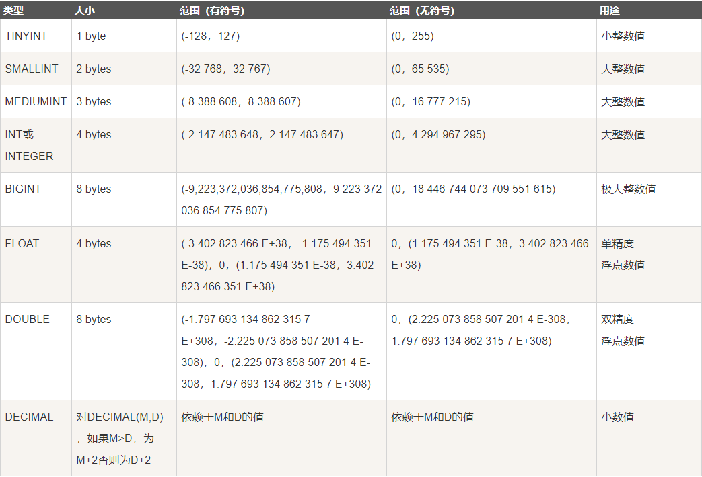
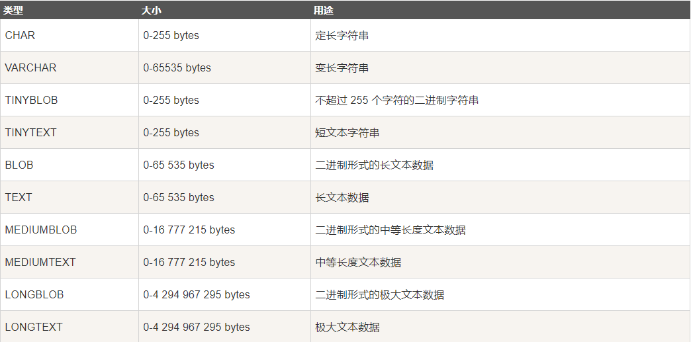
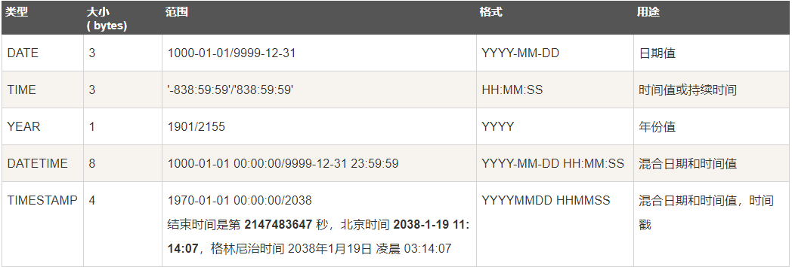

# 一、字段类型

> 概念

字段类型：MySQL 中用来规定实际存储的数据格式

- 字段类型在定义表结构时设定
- 设定好字段类型后，插入数据时必须与字段类型对应，否则数据错误
- MySQL 有三大数据类型
  - 数值类型
  - 字符串类型
  - 时间日期类型

## 1、数值类型



### 1.1 、整数型

- 数值型存储在 MySQL 中分为有符号和无符号，unsigned 表示无符号

- 显示宽度：int(L)，整数在数据库中显示的符号个数，负号会增加一个显示宽度，zerofill会填充宽度

### 1.2、浮点型

浮点数：float/double，存储不是特别精确的数值数据

- 浮点数又称为精度数据，分为两种
  - 单精度：float，使用 4 个字节存储，精度范围为 6-7 位有效数字
  - 双精度：double，使用 8 个字节存储，精度范围为 14-15 位有效数字
- 精度可以指定整数和小数部分
  - 默认不指定，整数部分不超过最大值，小数部分保留2位
  - 可以指定：float/double(总长度,小数部分长度)
- 可以使用科学计数法插入数据：AEB=A*10^B

> 步骤

1. 确定当前设计的字段的数据位不精确型数据（或者小数）
2. 确定数据的大小或者精度的要求范围
   - 6-7 位有效数字用 float
   - 14-15 位有效数字用 double
3. 确定精度的分布：整数部分和小数部分

### 1.3、定点型

> 定点型：decimal，能够保证精度的小数

- 不定存储空间，数据越大占用的空间越大
- 每九个数字使用 4 个字节存储
- 定点型可以指定整数部分长度和小数部分长度
  - 默认不指定，10 位有效数字，0位小数
  - 可以指定：decimal(有效数位,小数部分数位)
  - 有效数位不超过 5 位
- 数据规范
  - 整数部分超出报错
  - 小数部分超出四舍五入

> 步骤

1. 确定小数是否需要保证精度
2. 确定有效数位长度

## 2、字符串类型



### 2.1、定长型

> 概念

定长型：char(L)，指定固定长度的存储空间存储字符串

- 定长是指定存储长度
- 定长的长度是字符而不是字节
  - L 的最大值是255
  - 实际存储空间：L 字符数 * 字符集对应字节数
- 定长里存储的数据不能超过指定长度，但是可以小于指定长度
- 字符串数据使用单引号或者双引号包裹

> 步骤

1. 确定数据类型为字符串（或不能用整数存储的超长数字符号）
2. 确定数据长度基本一致（定长占用固定空间）
3. 确定具体长度

> 总结

定长的访问效率较高，但是空间利用率不高

- 固定长度的数据使用定长
- 定长最大数据长度指定最大不要超过 255 字符

### 2.2、变长型

> 概念

变长型：varchar(L)，根据实际存储的数据变化存储空间

- 变长型的存储空间是由实际存储数据决定的
- 变长型的 L 也是指定字符而不是字节
  - L 指定的是最大存储的数据长度
  - L 的最大值理论是 65535
  - 变长需要额外产生 1-2 个字节，用来记录实际数据的长度
    - 数据长度小于 256 个，多 1 个字节
    - 数据长度大于 256 个，多 2 个字节
  - 实际存储空间：实际字符数 * 字符集对应字节数 + 记录长度
- 变长数据不能超过定义的最大长度

> 步骤

1. 确定数据类型为字符串
2. 确定数据是不规则数据
3. 确定最大长度

### 2.3、文本字符串

> 概念

文本字符串：text/blob，专门用来存储较长的文本

- 文本字符串通常在超过 255 个字符时使用
- 文本字符串包含两大类
  - text：普通字符
  - blob：二进制字符（与 text 类似，如图片存储，现在通常不用）
- 文本字符串会自动根据文本长度选择适合的具体类型
- 一般在文本超过 255 个字符时，都会使用 text（blob现在极少使用），系统会自动选择 text 的类型

### 2.4、枚举

> 概念

枚举：一种映射存储方式，以较少的空间存储校对的数据

- 枚举是在定义时确定可能出现的可能
- 枚举在定义后数据只能出现定义时其中的一种
- 枚举类似一种单选框
- 枚举使用 1-2 字节存储，最多可以存储 65535 个选项
- 枚举实际存储存储使用数值，映射对应的元素数据，从 1 开始
- 枚举语法：enum(元素1,元素2,...,元素N)

> 步骤

1. 确定数据是固定的几种数据之一
2. 使用枚举穷举相应的元素
3. 数据存储只能选择穷举中的元素之一

> 示例

1. 记录人群类型

```mysql
create table t_16(
	type enum('小朋友', '少年', '青年', '中年', '老年')
)charset utf8;

insert into t_16 values('少年');
```

2. enum 是建立映射关系，然后实际存储是数字，数值是按照元素顺序从 1 开始

```mysql
# 可以使用字段+0来判断数据具体效果（字符串转数字为0）
select type, type+0 from t_16;
insert into t_16 values(5);
```

### 2.5、集合

> 概念

集合：set，一种映射存储方式，以较小的空间存储较多的数据

- 集合是在定义时确定可能出现的元素进行穷举
- 集合在定义后数据只能出现定义时其中的元素（可以是多个）
- 集合类似一种多选框
- 集合使用 1-8 个字节存储数据，最多可以设计 64 个元素
- 集合实际存储使用数值（二进制位），映射对应的元素数据，每个元素对应一个比特位
- 集合语法：set(元素1,元素2,...,元素N)

> 步骤

1. 确定数据是固定的几种数据组合
2. 使用集合穷举相应的元素
3. 数据存储只能选择穷举中的元素组合

> 示例

1. 记录个人爱好

```mysql
create table t_17(
	hobby set('足球', '篮球', '羽毛球', '网球')
) charset utf8;

insert into t_17 values('足球');
insert into t_17 values('足球,羽毛球');
```

## 3、日期类型



### 3.1、年

> 概念

年：year，MySQL 中用来存储年份的类型

- MySQL 中使用 1 个字节存储年份
- year 能够表示的范围是 1901-2155年（256年）
  - year 的特殊值是：0000
- year 允许用户使用两种方式设计（效果一样）
  - year
  - year(4)

> 步骤

1. 确定存储的数据是年份
2. 确定年份的却见在 1901-2155 之间
3. 使用 year 类型

> 示例

1. year 类型允许是允许 2 位数来插入，系统会自动匹配对应的年份

- 69以前：系统加上2000
- 69以后：系统加上1900

```mysql
insert into t_18 values(69,70);
```

2. year 的特殊值是0000，可以使用 00 或 0000 插入

```mysql
insert into t_18 values(00,0000);
```

> 总结

因为 year 字段表示的范围有限，所以通常使用字符串来存储

### 3.2、时间戳

> 概念

时间戳：timestamp，基于格林威治时间（1970年0时0分0秒）到现在的时间记录

- **MySQL 中**时间戳表现形式不是秒数，而是年月日时分秒格式
  - YYYY-MM-DD HH:II:SS
  - YYYYMMDDHHIISS
- timestamp 使用 4 个字节存储
- timestamp 的特点是所对应的记录不论哪个字段被更新，该字段都会更新到当前时间

> 步骤

1. 确定类型需要使用年月日时分秒格式
2. 确定当前字段需要记录数据的最近更新时间
3. 使用 timestamp 时间戳

> 示例

1. 记录商品库存的最后更新时间

```mysq
create table t_19(
	goods_name varchar(10),
	goods_inventory int unsigned,
	change_time timestamp
)charset utf8;

insert into t_19 values('Mi10', 100, '1971-01-01 00:00:00');
insert into t_19 values('Mi10', 100, '19710101000000');
```

2. timestamp 会在自己所在的记录任何位置被修改时自动更新时间

```mysql
update t_19 set goods_inventory = 90;
```

注意：在 MySQL8以后，取消了 timestamp 的默认自动更新。如果需要使用，需要额外使用属性：on update current timestamp

```mysql
alter table t_19 add c_time timestamp on update current_timestamp;

update t_19 set goods_inventory = 80;
```

### 3.3、日期

> 概念

日期：date，用来记录年月日信息

- 使用 3 个字节存储数据
- 存储日期格式为：YYYY-MM-DD
- 存储范围是：1001-01-01~9999-12-31

> 步骤

1. 确定存储的数据格式为日期类格式
2. 确定数据格式为 YYYY-MM-DD
3. 使用 date 类型

> 示例

记录个人生日

```mysql
create table t_20(
	name varchar(10),
    birth date
) charset utf8;

insert into t_20 values('Jim', '2000-12-12');
insert into t_20 values('Tom', '20001212');
```

### 3.4、日期时间

> 概念

日期时间：datetime，用来综合存储日期和时间

- 使用 8 个字节存储数据
- 存储格式为：YYYY-MM-DD HH:II:SS
- 存储范围：1000-01-01 00:00:00 到 9999-12-31 23:59:59

> 示例

记录个人出生的具体时间

```mysql
create table t_21(
	name varchar(10),
    birth datetime
) charset utf8;

insert into t_21 values('Jim', '2000-12-12 12:12:12');
insert into t_21 values('Tom', '20001212121212');
```

### 3.5、时间

> 概念

时间：time，用来记录时间或时间段

- 使用 3 个字节存储数据
- 数据范围是 -838:59:59 ~ 838:59:59
- 数据插入的格式分为两种
  - 时间格式：[H]HH:II:SS
  - 时间段格式：D HH:II:SS

> 示例

记录用户的登录具体时间

```mysql
create table t_22(
	login_time1 int unsigned,
    login_time2 datetime,
    login_date date,
    login_time time
)charset utf8;

insert into t_22 values(12345678, '2000-12-12 12:12:12', '2000-12-12', '12:12:12');
insert into t_22 values(12345678, '2000-12-12 12:12:12', '2000-12-12', '3 12:12:12');
```

# 二、字段属性

> 学习目标：了解属性的类型和作用，掌握使用属性来完成表字段的约束和控制

- 空属性
- 默认值属性
- 主键
- 唯一键属性
- 自动增长
- 字段描述

## 1、属性作用

> 概念

属性：建立在字段类型之后，对字段除类型之外进行其他约束

- 属性是在定义表字段的是时候针对每个字段进行属性设定
- 设定好的属性可以通过 desc 进行查看
- 设局在进行增删改操作时需要在满足字段的要求同时还要满足属性的要求

> 示例

查看表属性：desc 表名

```mysql
desc t_1;
```

## 2、Null 属性

> 概念

Null：数据是否允许为空

- 默认情况下数据允许为空
- 不为空：not null
- 数据为空一般不具备运算和分析价值，所以通常数据都需要设定为 not null（不区分大小写）

## 3、Default属性

> 概念

默认值：default，在设计表的时候给定默认数据，在后续字段操作时系统没有检测到字段有数据就使用默认值。

- 默认值在字段设计的时候使用
- 默认值通常设计的是字段容易出现的数据
  - 一般字段的默认值是 null
- 默认值触发
  - 在系统进行数据插入时自动检测触发
  - 主动使用 default 关键字触发值

> 示例

默认值触发

```mysql
# 默认触发
insert into t_24(account, id_card, name) values('123', '123', 'Lily');

# 主动触发
insert into t_24 values('123', '123', 'Lily', default);
```

## 4、主键

> 概念

主键：primary key，用来保证整张表中对应的字段永远不会出现重复数据

- 主键在一张表中只有一个
- 主键的另一个特性是能够提示主键字段作为查询条件的效率（索引）
- 主键不能为空：not null（默认）
- 逻辑主键：数据没有具体业务意义，纯粹是一种数值数据
  - 逻辑主键通常是整数：int
  - 逻辑主键目的是方便检索和数据安全（不暴露数据真实信息）
- 复合主键：多个字段共同组成不能重复的数据
  - primary key（字段1,字段2,...,字段N）
  - 联合主键使用不多，一般也不会超过 2 个字段

> 示例

1. 复合主键

```mysql
create table t_25(
	account varchar(17),
    name varchar(20),
    primary key(account, name)
)charset utf8;
```

2. 逻辑主键

```mysql
create table t_26(
    id int unsigned primary key,
	account varchar(17),
    name varchar(20)
)charset utf8;
```

> 小结

1. 一张表只能有一个主键
2. 虽然主键可以用来保证数据的唯一性，但是一般都是使用逻辑主键作为主键字段
3. 通常也不怎么使用复合主键

## 5、主键管理

> 概念

主键管理：在创建表并且已经有数据后的维护

- 删除主键
- 追加主键
- 修改主键（先删除后新增）

> 示例

1. 删除主键

```mysql
alter table t_26 drop primary key;
```

2. 后期新增主键（数据不能为 null）

```mysql
alter table t_26 add primary key(account,name);
```

## 6、自增长属性

> 概念

自增长：auto_increment，被修饰的字段在新增时，自动增长数据

- **自增长只能是整数类型**，而且**对应的字段必须时一个索引**（通常是逻辑主键）
- 一张表只能有一个自动增长
- 自增长数据可以理解为一种默认值，如果主动给值，那么自动增长不会触发
- 自增长由两个变量控制
  - 初始值：`auto_increment_offset`，默认是 1
  - 步长：`auto_increment_increment`，默认值也是 1
  - 查看自增长控制：`show variables like 'auto_increment%';`

## 7、自增长管理

> 概念

自增长管理：在某些特殊使用下，需要自增长按照需求实现

- 修改表中自增长的值：让下次自增长按照指定值开始
- 修改自增长控制：调整自增长变化

> 示例

1. 修改表中自增长的值，跳过一些值，直接从下次开始按照新的目标值出现

```mysql
alter table t_28 auto_increment=50;
```

注意：奇数会保留原值，偶数会自动加 1（可能出现的情况）

2. 修改自增长控制：步长和起始值（修改针对的是整个数据库，而非单张表）

```mysql
set auto_increment_increment = 2;   # 当前用户当前连接有效（局部） 
set @@auto_increment_increment = 2; # 当前用户一直有效（全局）
```

> 小结

1. 自动加载通常不会修改，如果有规则要求必须改，通常也会在数据库运行前修改好
2. 如果碰到要修改操作的，通常会选择全局修改而不是局部修改

## 8、唯一键

> 概念

唯一键：unique key，用来维护数据的唯一性

- 一个表中可以有**多个**唯一键
- 唯一键与主键的区别在于**唯一键允许数据为 null（而且 null 的数量不限）**
- 唯一键与主键一样，可以提升字段数据当做条件查询的效率（唯一键是索引）
- 复合唯一键：多个字段共同组成
  - unique key(字段1,字段2,...,字段N)
  - 一般不会出现，最多两个字段组成

> 步骤

1. 确定数据列具有唯一性
2. 确定数据列不用作为主键
3. 确定数据会经常用于检索条件
4. 唯一键字段是否允许数据为空
   - 为空：普通唯一键
   - 不为空：not null（唯一键与主键效果一样）
5. 使用唯一键

> 示例

1. 用户表：用户名唯一，而且经常作为查询条件

## 9、唯一键管理

> 概念

唯一键管理：在表创建后对唯一键的管理

- 删除：`alter table 表名 drop index 唯一键名;`
- 新增：`alter table 表名 add unique key(字段列表);`

## 10、comment 属性

> 概念

描述：comment，用文字描述字段的作用

- comment 代表的内容是对字段的描述
  - 方便以后自己了解字段的作用
  - 方便团队了解字段的作用
- 描述如果涉及到字符集（中文）一定要在创建表之前设置好客户端字符集（否则会出现描述乱码）、
- 查看描述信息：`show create table;`

> 步骤

1. 字段命名不是特别简单
2. 使用 comment 增加简易描述

# 三、数据库的数据长度

> 概念

数据库记录长度：MySQL 中规定一条记录所占用的存储长度最长不要超多 65535 个字节

- 记录长度为表中所有字段预计占用的长度之和
- 所有字段只要允许 null 存在，系统就会预留一个字节存储 null（多个 null 也只要一个就好）
- 因为 MySQL 记录长度存在，varchar 永远达不到理论长度
- 一般数据长度超过 255 个字符都会使用 text/blob 进行存储（数据存储不占用记录长度）

> 步骤

1. 字符串字段如果超多 255 个字符，使用 text/blob 替代
2. 所有字段是否有允许为 null 的，如果有要占用 1 个字节
3. 计算字段所占用的预计长度不要超多 65535 字节

> 示例

1. GBK 表能存储的最大 varchar 字符串长度

```mysql
create table t_32(
	content varchar(65535)
)charset gbk; # 报错
```

