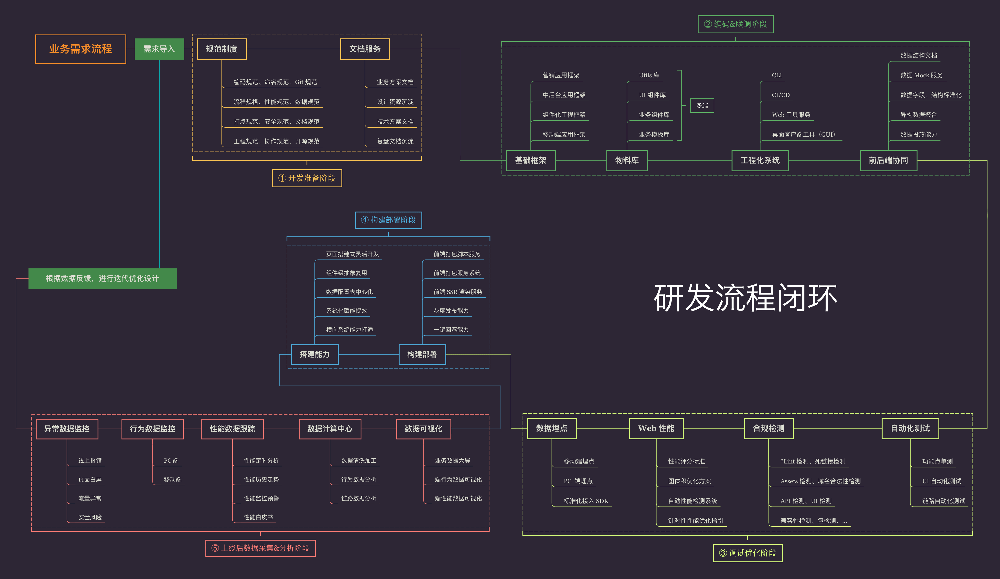

# 早早聊如何搞基建

时间：2020年3月25日

发布方：[前端早早聊](https://www.yuque.com/zaotalk/posts/s2ppt#INUV5)

## 新浪小爝 - 如何推动基础架构项目落地

### 一、自我介绍

- 2011年入职，2017年就职新浪博客
- 从业务到基础建设
- 入职两年多，至今没见过产品经理长啥样

### 二、如何建设基础团队

#### 1. 需要什么样的人

- 能折腾的，持续学习新技术，工作经验比较久的。

#### 2. 需要做什么样的事儿

- 基础组件和SDK、工程化相关的建设、后台系统、新技术的调研

- 业务开发服务，给业务技术赋能，就是基础团队要做的事

#### 3. 需要掌握什么技能

- 语言方面不设限
- 领域方面不设限

#### 4. 需要什么性格的人

- 爱折腾
- 保守派、激进派如何更好地配合

## 堂主 - 如何推动前端团队的基础设施建设

### 一、介绍

堂主，马翀，2011年淘宝实习，2012年加入淘宝；2016年在蘑菇街做TL；2018年至今在政采云，负责前端团队工作。

###  二、基础建设研发流程

