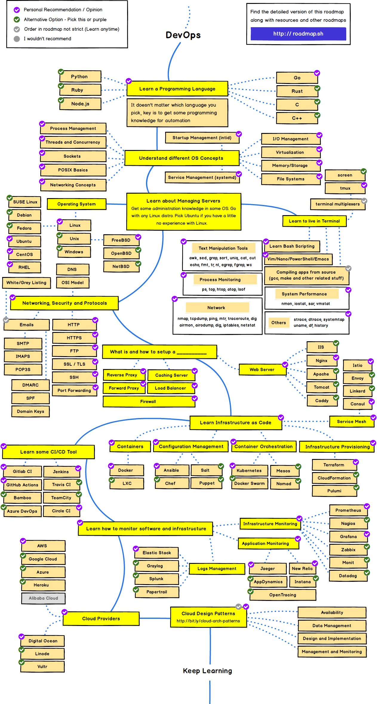

# Web 开发者成长地图

来自[kamranahmedse](https://github.com/kamranahmedse/developer-roadmap)

## 2020 年版

### 基本知识

### 前端路线图

在这份地图里，你需要从注意包管理之后的知识。

- 测试：理解单元，集成，功能测试的区别
- 服务端渲染：Next.js
- 移动应用：React Native
- 桌面应用：Electron
- GraphQL：Apollo
- 静态站点生成器：Next.js，GatsbyJS

### 后端路线图

这份地图，你需要注意

- 数据库：PostgreSQL，MongoDB，索引
- API：REST，授权
- 缓存：客户端缓存，如 CDN，服务端缓存，如 Redis
- CI/CD
- 设计和开发原则
- Web 服务器：Nginx
- ...

### DevOps 路线图

在这份图里，需要注意的有：

- 学习一门自动化的语言：Go
- 学习管理服务器：操作系统，命令行
- 网络、安全和协议
- 如何设置代理、缓存服务器、负载均衡服务器、防火墙
- 学习基础设施服务：容器，配置管理
- 学习 CI 工具
- 监控：软件、基础设施、日志管理
- 云

