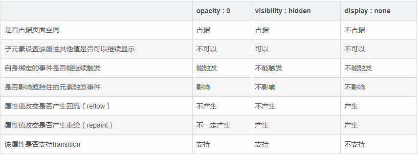

# display、visibility、opacity

## display

```css
display: none; // 元素完全不可见
```

## visibility

`visibility`显示或隐藏元素而不更改文档的布局。它可以继承。

关键字属性：

- visible：元素正常显示，默认值。
- hidden：隐藏元素，相当于此元素变成透明。如果将其子元素设为visible，则该子元素依然可见。
- collapse：可用于表格的行和列等功能。

全局属性：

- inherit
- initial
- unset

> 如果子元素设置为visible，是可以显示出来的。

## opacity

`opacity`指定一个元素的透明度。当opacity属性的值应用于某个元素上时，是把这个元素当成一个整体看待，即使这个值没有被子元素继承。因此，一个元素和它包含的子元素都会具有和元素背景相同的透明度，哪怕这个元素和它的子元素有不同的opacity属性值。

> 使用opacity属性，当属性值不为1时，会把元素放置在一个新的层叠上下文。

> 即使子元素设置为1，也**不**会显示出来。

## 区别



图来自[**FEWY**](https://segmentfault.com/u/fewy)

---

参考：

[MDN visibility](https://developer.mozilla.org/zh-CN/docs/Web/CSS/visibility)

[**FEWY**](https://segmentfault.com/u/fewy)