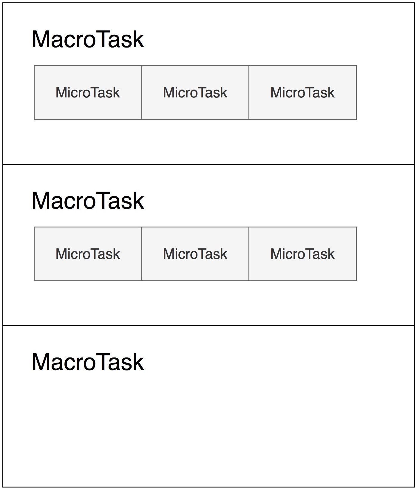

# Promise里的代码为什么比setTimeout先执行？

在ES3和更早的版本中，JavaScript本身还没有异步执行代码的能力，这也就意味着，宿主环境传递给JavaScript引擎一段代码，引擎就把代码直接顺次执行了，这个任务也就是宿主发起的任务。

在ES5之后，JavaScript引入了Promise，这样，不需要浏览器的安排，JavaScript引擎本身也可以发起任务了。

## 宏观和微观任务

我们把宿主发起的任务称为**宏观任务**，把JavaScript引擎发起的任务称为**微观任务**。

JavaScript引擎等待宿主环境分配宏观任务，在操作系统中，通常等待的行为都是一个事件循环，所以在Node术语中，也会把这个部分称为事件循环。

这里每次执行的过程，其实就是一个宏观任务。我们可以大概理解：**宏观任务的队列就相当于事件循环。**

在宏观任务中，JavaScript的Promise还会产生异步代码，JavaScript必须保证这些异步代码在一个宏观任务中完成，因此，**每个宏观任务中又包含了一个微观任务队列**：

有了宏观任务和微观任务机制，我们就可以实现JS引擎和宿主级的任务了。例如：**Promise永远在队列尾部添加微观任务，setTimeout等待宿主API，则会添加宏观任务**。



图来自重新前端

## Promise

Promise是JavaScript语言提供的一种标准化的异步管理方式，它的总体思想是，需要进行IO、等待或者其他异步操作的函数，不返回真实结果，而是返回一个“承诺”。函数的调用方可以在合适的时机，选择等待这个承诺兑现（通过Promise的then方法的回调）。

```js
function sleep(duration){
  return new Promise(function(resolve, reject){
  	setTimeout(resolve, duration);
  })
}
sleep(1000).then( () => console.log("finished"));
```

Promise的then回调是一个异步的执行过程，下面我们来研究一下Promise函数中的执行顺序：

```js
let r = new Promise(function(resolve, reject){
  console.log("a");
  resolve()
})

r.then(() => console.log("c"))
console.log("b")

// a
// b
// c
```

再看：

```js
let r = new Promise(function(resolve, reject){
  console.log("a");
  resolve()
})

setTimeout(()=>console.log("d"), 0)
r.then(() => console.log("c"))
console.log("b")

// a
// b
// c
// d
```

结果发现，不论代码顺序如何，d必定发生在c之后，因为Promise产生的是JavaScript引擎内部的微任务，而setTimeout是浏览器API，它产生宏任务。

## 新特性：async/await

它提供了用for、it等代码结构来编写异步的方式，它的运行时基础是Promise。

async函数必定返回Promise，我们把所有返回Promise的函数都可以认为是异步函数。

```js
function sleep(duration) {
    return new Promise(function(resolve, reject) {
        setTimeout(resolve,duration);
    })
}
async function foo(){
    console.log("a")
    await sleep(2000)
    console.log("b")
}
```

## 作业：[实现红绿灯](https://shijiatongxue.github.io/demo/promise/)

```js
// javascript代码部分
<script>
    let dom = document.getElementsByTagName('div')[0];
    function sleep(t){
      return new Promise(function(resolve, reject){
        setTimeout(resolve, t)
      })
    }
    async function changeColor(color, duration){
      dom.style.background = color
      await sleep(duration)
    }
    async function main(){
      while(true){
        await changeColor('red', 2000)
        await changeColor('yellow', 1000)
        await changeColor('green', 3000)
      }
    }
    main()
<script>
```


---

来自：重学前端

