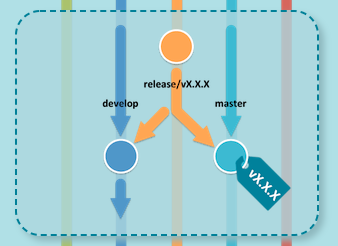
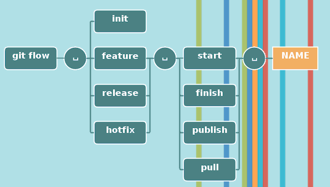

# git-flow

git-flow是git命令的包装器。它适合[语义化版本](https://semver.org/lang/zh-CN/)的项目。

## 初始化

```
git flow init
```

 ## 特性

### 添加新特性

新特性的开发是基于 `develp` 分支的。


```bash
git flow feature start MYFEATURE
```

这个操作创建了一个基于 `develop` 的特性分支，并切换到这个分支下。

### 完成新特性

完成开发新特性。这个动作执行下面的操作。

- 合并MYFEATURE分支到 `develop` 
- 删除这个新特性分支 
- 切换到 `develop` 分支


```bash
git flow fearture finish MYFEATURE
```

### 发布新特性

发布新特性到远程服务器。

```bash
git flow feature publish MYFEATURE
```

### 取得一个发布的新特性分支

取得其他用户发布的新特性分支，并签出远程的变更。

```bash
git flow feature pull origin MYFEATURE
```

也可以使用

```bash
git flow feature track MYFEATURE
```

跟踪在oringin上的特性分支。

## 作一个 release 版本

支持一个新的用于生产环境的发布版本。

允许修正小问题，并为发布版本准备元数据。

> 对于没有版本概念的项目来说，可以不创建release分支，但是如果有版本号，release分支可能是实用的。


它从 `develop` 分支开始创建一个 `release` 分支。 

### 开始准备 release 版本

```bash
git flow release start RELEASE [BASE]
```

你可以选择一个 `[BASE]` 参数，即提交记录的sha-1 hash值，来开启 `release` 分支，这个提交记录的sha-1 hash值必须是 `develop` 分支下的。

### 发布 release 分支到远程

创建 `release` 分支之后立即允许其他用户向这个分支提交内容是个明智的做法。命令十分类似发布新特性：

```bash
git flow release publish RELEASE
```

你可以通过

```bash
git flow release track RELEASE
```

命令签出release版本的远程变更。

### 完成 release 版本

完成release版本是一个大git分支操作。它执行下面几个动作：

- 归并release分支到master分支
- 用release分支名打Tag
- 归并release分支到develop分支
- 移除release分支



```bash
git flow release finish RELEASE
```

## 紧急修复

紧急修复来自这样的需求：生成环境的版本处于一个不预期的状态，需要立即修正。

`hotfix` 分支有一点点像 `release` 分支，除了它是基于 `master` 分支而不是 `develop` 分支。

有可能是需要修正master分支上某个TAG标记的生产版本。

### 开始 git flow 紧急修复


```bash
git flow hotfix start VERSION [BASENAME]
```

VERSION参数标记着修正版本。你可以从[BASENAME]开始，[BASENAME]为finish release时填写的版本号。

## 完成紧急修复

当完成紧急修复分支，代码归并会develop和master分支。相应地，master分支打上修正版本的TAG。


```bash
git flow hotfix finish VERSION
```

## 命令



---

参考：

- [Using git-flow to automate your git branching workflow](https://jeffkreeftmeijer.com/git-flow/)

- [git-flow 备忘清单](http://danielkummer.github.io/git-flow-cheatsheet/index.zh_CN.html)

- [Learn Version Control with Git](https://www.git-tower.com/learn/git/ebook/cn/command-line/advanced-topics/git-flow)

- [语义化版本](https://semver.org/lang/zh-CN/)
- [Github](https://github.com/petervanderdoes/gitflow-avh)

