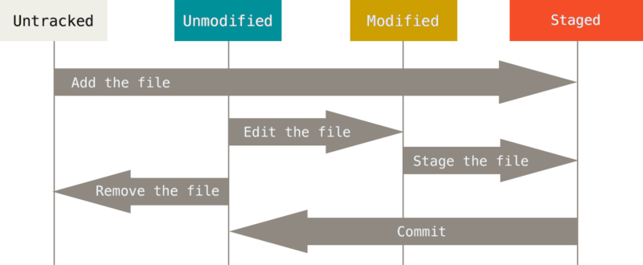

# git

## Git基础

### 获取Git仓库

- 初始化仓库

```bash
git init
```

- 跟踪文件

```bash
# 跟踪所有的C文件
git add *.c
```

- 提交跟踪

```bash
git commit -m 'say something'
```

- 克隆现有仓库

```bash
git clone [url]
```

### 记录每次更新到仓库



上图：文件的状态变化周期

- 检查文件状态

```js
git status
```

- 跟踪新文件

```
git add [filename]
```

- 状态简览

```js
git status -s
```

- 跳过使用暂存区域

```bash
git commit -a -m 'say something'
```

- 移除文件，但保留在磁盘

移除文件需要从暂存区移除，然后提交。

```bash
git rm [-f] [filename]
```

它完成的工作是从工作目录中删除指定的文件，这样以后就不会出现在未跟踪文件清单中了。

- 从暂存区移除，但保存在磁盘

```bash
git rm --cached [filename]
```

### 查看提交历史

- 查看提交历史

```bash
git log
```

参数：-p 显示每次提交的内容差异。 -2 仅显示两次提交。

### 撤销操作

- 撤销操作

```bash
git commit --amend
```

- 取消暂存文件

```bash
git reset HEAD <file>
```

- 撤销对文件的修改

```bash
git checkout -- <file>
```

### 远程仓库的使用

- 查看远程仓库

```bash
git remote
# origin
```

-v 显示需要读写远程仓库使用的Git保存的简写与其对应的URL。

- 添加远程仓库

```bash
git remote add <shortname> <url>
```

- 从远程仓库抓取与拉取，但不会合并

```bash
git fetch [remote-name]
```

```git pull``` 会自动合并。

- 推送到远程仓库

```bash
git push [remote-name] [brance-name]
```

- 查看某个远程仓库

```bash
git remote show origin
```

- 远程仓库的移除和重命名

```bash
# 重命名
git remote rename oldname newname
```

```bash
# 移除
git remote rm paul
```

## Git分支

### 分支新建与合并

- 新建分支并切换

```bash
git checkout -b iss53
```

等于：

```bash
git branch iss53
git checkout iss53
```

- 删除分支

```bash
git branch -d iss53
```

- 查看冲突

```bash
git status
```

冲突内容：

```bash
<<<<<<< HEAD:index.html
<div id="footer">contact : email.support@github.com</div>
=======
<div id="footer">
 please contact us at support@github.com
</div>
>>>>>>> iss53:index.html
```

HEAD部分是当前所在分支的内容，而下面的是合并文件添加的新内容。

- 解决冲突后的操作

```bash
git add
git commit
```

### 分支变基

整合不同分支的修改主要有两种方法：merge和rebase。

可以使用rebase命令将提交到某一分支上的所有修改都移至另一分支，就好像重新播放一样。


在上面这个例子中：

```bash
git checkout experiment
git rebase master
```

它的原理时首先找到两个分支的最近公共祖先C2，然后对比当前分支相对于该祖先的历次提交，提取相应的修改并存为临时文件，然后将当前分支指向目标基底C3，最后以此将之前另存为临时文件的修改依序应用。


图：将C4中的修改变基到C3上

现在回到master分支，进行一次快进合并：

```bash
git checkout master
git merge experiment
```


图：master分支的快进合并

注意：无论是rebase还是三方merge，整合的最终结果所指向的快照始终是一样的，只不过提交历史不同。rebase是将一系列提交按照原有次序一次应用到另一分支上，而merge是把最终结果何在一起。

## Git内部原理

从根本上说，Git时一个内容寻址文件系统，并在此之上提供了一个版本控制系统的用户界面。

- 查看更改内容

```bash
git diff -cached
```

---

参考：

Pro Git

[Git 是怎样生成 diff 的：Myers 算法](https://cjting.me/2017/05/13/how-git-generate-diff/)


