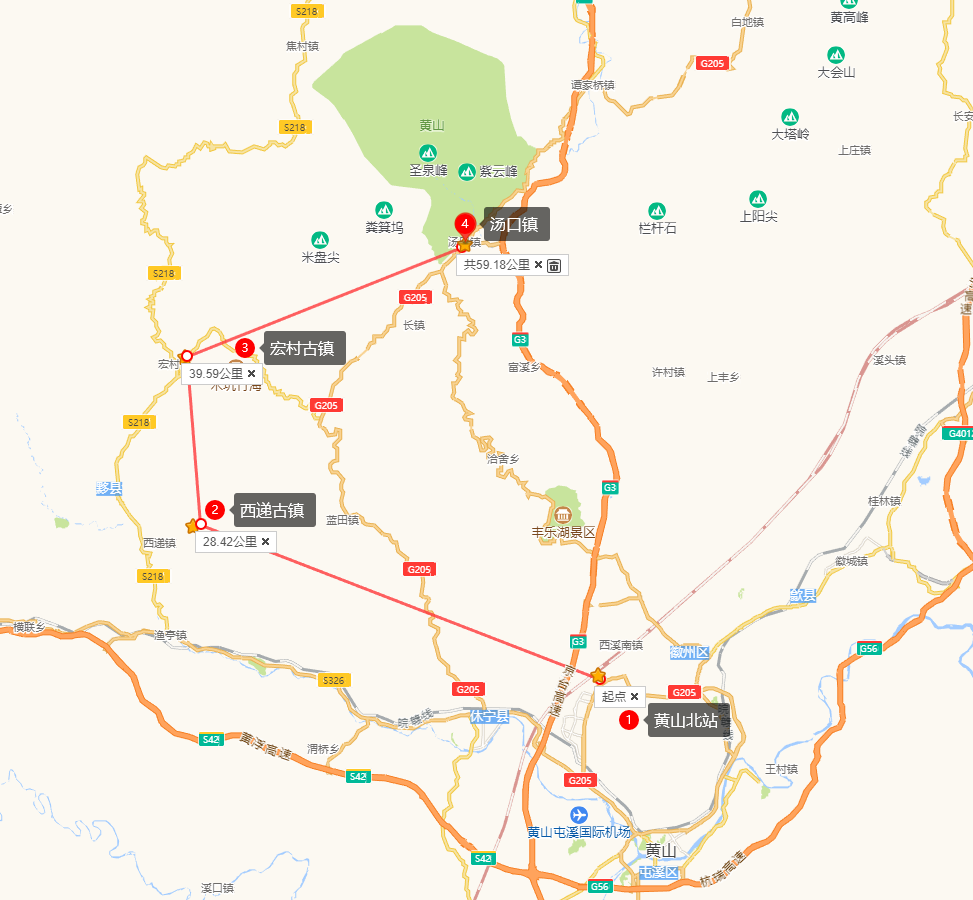
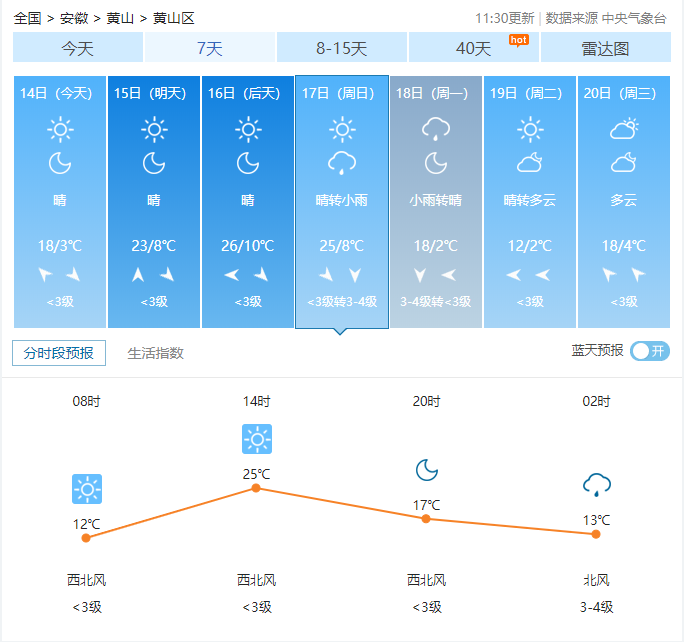
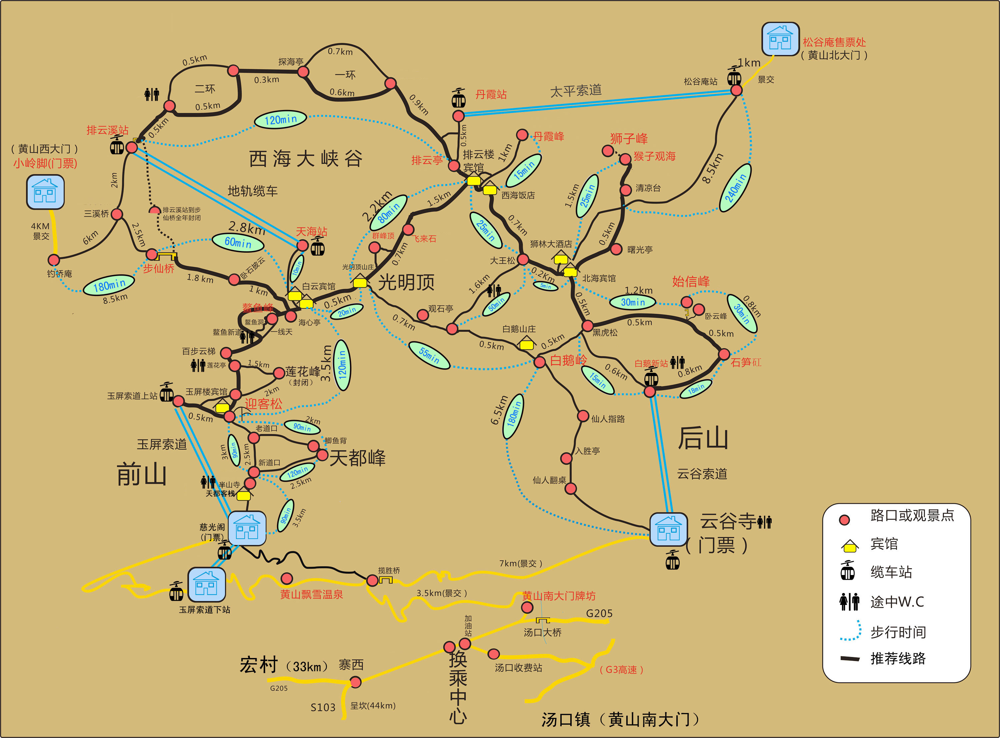

# 黄山攻略

## 兵马未动粮草先行

- 黄山区温度

- 食物：巧克力、士力架、火腿1包、水*4瓶、自热饭两份
- 其他：手套、雨衣？

## Day-1

- 武汉——黄山北：4.5小时

- 黄山北——宏村：1.5小时，车票20左右

- 宏村门票104元，优惠票52元。
- 住宿：宏村【她的故事】或汤口镇【小时代艺术民宿】

## Day-2

- 宏村-汤口镇：1小时，车票15元，拼车20元/人

- 登山策略：后山上，前山下。

- 登山路线：云谷寺-云谷索道-石笋峰-始信峰-梦笔生花-猴子观海-狮子峰-排云亭-西海大峡谷-白云宾馆

## Day-3

- 登山路线：白云宾馆-**光明顶**-白云宾馆-海心亭-一线天-百步云梯-迎客松-莲花峰-天都峰-半山寺-慈光阁-南大门换乘中心

- 日出时间：6:36
- 推荐馆子：美食人家

## Day-4

已经回到武汉，这是我们的黄山之行记录。 [秋季游黄山看日出攻略](https://zhuanlan.zhihu.com/p/92262223 )

