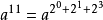

# 快速幂



```js
function pow(a, b) {
    if (b%1 !== 0) {return console.log('幂应为整数')};
    let res = 1, base = a;
    while (b !== 0) {
        if (b%2){ res *= base;}
        base *= base;
        b = Math.floor(b/2);
    }
    return res;
}
```

