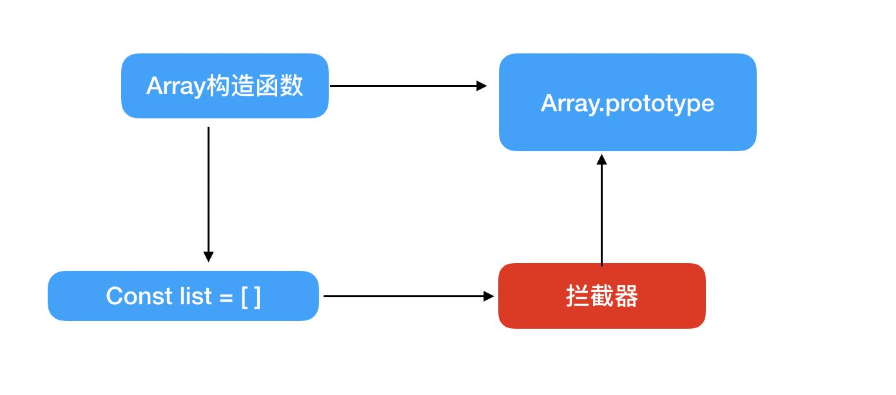

# Array的变化检测

Array的侦测方式与Object不同：

```js
this.list.push(1)
```

上面这个例子使用push方法来改变数组，并不会触发getter/setter。

正因为我们可以通过Array原型上的方法来改变数组的内容，所以Object那么通过getter/setter的实现方式就性不通了。

## 如何追踪变化



我们可以用一个拦截器覆盖Array.prototype。之后，每当使用Array原型上的方法操作数组时，其实执行的都是拦截器中提供的方法，比如push方法。然后，在拦截器中使用Array原型方法去操作数组。

## 拦截器

拦截器其实就是一个和Array.prototype一样的Object，里面包含的属性一模一样，只不过这个Object中某些可以改变数组自身内容的方法使我们**处理**过的。

Array原型中可以改变数组自身内容的方法有7个：

- push
- pop
- shift
- unshift
- sort
- reverse
- splice

下面我们写出代码：

```js
const arrayProto = Array.prototype
export const arrayMethods = Object.create(arrayProto)

['push', 'pop', 'shift', 'unshift', 'splice', 'sort', 'reverse']
.forEach(function (method) {
  const original = arrayProto[method]
  Object.defineProperty(arrayMethods, method, {
  	value: function mutator (..args) {
    	return original.apply(this, args)
    },
    enumerable: false,
   	writable: true,
    configurable: true
  })
})
```

在上面的代码中，我们创建了变量arrayMethods，它继承自Array.prototype，具备其所有功能。未来，我们要使用arrayMethods去覆盖Array.prototype。

## 使用拦截器覆盖Array原型

有了拦截器，想要让他生效，就需要使用它去覆盖Array.prototype。但是我们又不能直接覆盖，因为这样会污染全局Array。我们希望拦截操作只针对那些被侦测变化的数据生效，也就是说希望只覆盖那些响应式数组的原型。

而将一个数据转化为响应式的，需要通过Observer，所以我们只需要在Observer中使用拦截器覆盖那些即将转换成响应式Array类型数据的原型就好了：

```js
export class Observer {
  constructor (value) {
  	this.value = value
  	
   	if (Array.isArray(value)) {
    	value.__proto__ = arrayMethods // 新增
    } else {
    	this.walk(value)
    }
  }
}
```

## 将拦截器方法挂载到数组的属性上

虽然绝大多数浏览器都支持这种非标准的属性（在ES6之前并不是标准）来访问原型，但并不是所有浏览器都支持！因此，我们需要处理不能使用\_\_proto\_\_的情况。

Vue的做法非常粗暴，如果不能使用\_\_proto\_\_，就直接将arrayMethods身上的这些方法设置到被侦测的数组上：

```js
import { arrayMethods } from './array'

// __proto__是否可用
const hasProto = '__proto' in {}
const arrayKeys = Object.getOwnPropertyNames(arrayMethods)

export class Observer {
  constructor (value) {
  	this.value = value
  }
  
  if (Array.isArray(value)) {
  	// 修改
  	const augment = hasProto ? protoAugment : copyAugment
    augment(value, arrayMethods, arrayKeys)
  } else {
 		this.walk(value)
  }

	// ...
}

function protoAugement (target, src, keys) {
	target.__proto__ = src
}

function copyAugment (target, src, keys) {
 	for (let i = 0, l = keys.length; i < l; i++) {
  	const key = keys[i]
    def(target, key, src[key])
  }
}
```

在浏览器不支持\_\_proto\_\_的情况下，会在数组上挂载一些方法。当用户使用这些方法时，其实执行的并不是浏览器原生提供的Array.prototype上的方法，而是拦截器中提供的方法。

## 如何收集依赖

对于对象，我们在getter中收集依赖，依赖被存储在Dep里。

```json
{
  list: [1, 2, 3, 4, 5]
}
```

```js
this.list
```

和对象类似，我们通过数组名字访问数组，这时就是触发了list这个属性的getter。

而Array的依赖和Object一样，也是在defineReactive中收集。

## 依赖列表存在哪儿

Vue.js把Array的依赖存放在Observer中：

```js
export class Observer {
  constructor (value) {
  	this.value = value
    this.dep = new Dep() // 新增dep
  }
  
  if (Array.isArray(value)) {
 		const augment = hasProto ? protoAugment : copyAugment
    augment(value, arrayMethods, arrayKeys)
  } else {
  	this.walk(value)
  }
	
	// ...
}
```

上一节我们介绍了数组在getter中收集依赖，在拦截器中触发依赖，所以这个依赖保存的位置就很关键，它必须在getter和拦截器中都可以访问到。

我们之所以将依赖保存在Observer实例上，是因为在getter中可以访问到Observer实例，同时在Array拦截器中也可以访问到Observer实例。

后面会介绍如何在getter中访问Dep开始收集依赖，以及在拦截器中如何访问Observer实例。

## 收集依赖

```js
function defineReactive (data, key, val) {
  let childOb = observe(val) // 修改
  let dep = new Dep()
  Object.defineProperty(data, key, {
  	enumerable: true,
  	configurable: true,
    get: function () {
   		dep.depend()
      
      // 新增
     	if (childOb) {
      	childOb.dep.depend()
      }
     	return val
    },
    set: function (newVal) {
    	if (val === newVal) {
     		return
      }
     	dep.notify()
      val = newVal
    }
  })
}

/**
	* 尝试为value创建一个Observer实例，如果创建成功，直接返回创建的Observer实例。
	* 如果value已经存在一个Observer实例，则直接返回它
	*/
export function observe (value, asRootData) {
  if (!isObject(value)) {
  	return
  }
  let ob
  if (hasOwn(value, '__ob__') && value.__ob__ instanceof Observer) {
  	ob = value.__ob__
  } else {
		ob = new Observer(value)
  }
  return ob
}
```

在上面的代码中，我们新增了observe，它尝试创建一个Observer实例。如果value已经是响应式数据，不需要再次创建Observer实例，直接返回已经创建的Observer实例即可，避免了重复侦测value变化的问题。

此外，我们在defineReactive函数中调用了observe，它把val当做参数传了进去并拿到一个返回值，那就是Observer实例。

前面我们介绍过数组为什么在getter中收集依赖，而defineReactive函数中的val很有可能会是一个数组。通过observe我们得到数组的Observer实例（childOb），最后通过childOb的dep执行depend方法来收集依赖。

通过这种方式，我们就可以在getter中将依赖收集到Observer实例的dep中。

## 在拦截器中获取Observer实例

因为Array拦截器是对原型的一种封装，所以可以在拦截器中访问到this（当前正在被操作的数组）。

而dep保存在Observer中，所以需要在this上读到Observer实例：

```js
// 工具函数
function def (obj, key, val, enumerable) {
  Object.defineProperty(obj, key, {
  	value: val,
    enumerable: !!enumerable;
  	writable: true,
    configurable: true
  })
}

export class Observer {
  constructor (value) {
  	this.value = value
    this.dep = new Dep()
   	def(value, '__ob__', this) // 新增
                      
   	if (Array.isArray(value)) {
    	const augment = hasProto ? protoAugment : copyAugment
      augment(value, arrayMethods, arraykeys)
    } else {
    	this.walk(value)
    }
  } 
 	
  // ...
}
```

在上面的代码中，我们在Observer中新增了一段代码，它可以在value上新增一个不可枚举的属性\_\_ob\_\_，这个属性的值就是当前Observer的实例。

这样我们就可以通过数组数据的\_\_ob\_\_属性拿到Observer实例，然后就可以拿到\_\_ob\_\_上的dep了。

当value身上被标记了\_\_ob\_\_之后，就可以通过value.\_\_ob\_\_来访问Observer实例。如果是Array拦截器，因为拦截器是原型方法，所以可以直接通过this.\_\_ob\_\_来访问Observer实例。例如：

```js
['push', 'pop', 'shift', 'unshift', 'splice', 'sort', 'reverse']
.forEach(function (method) {
  // 缓存原始方法
  const original = arrayProto[method]
  Object.defineProperty(arrayMethods, method, {
  	value: function mutator (..args) {
      const ob = this.__ob__ // 新增
    	return original.apply(this, args)
    },
    enumerable: false,
   	writable: true,
    configurable: true
  })
})
```

在上面的代码中，我们在mutator函数里通过this.\_\_ob\_\_来获取Observer实例。

## 向数组的依赖发送通知

当侦测到数组发生变化时，会向依赖发送通知。此时，首先要能访问到依赖。前面已经介绍了如何在拦截器中访问Observer实例，所以这里只需要在Observer实例中拿到dep属性，然后直接发送通知就可以了。

```js
['push', 'pop', 'shift', 'unshift', 'splice', 'sort', 'reverse']
.forEach(function (method) {
  // 缓存原始方法
  const original = arrayProto[method]
  Object.defineProperty(arrayMethods, method, {
  	value: function mutator (..args) {
      const ob = this.__ob__
      ob.dep.notify() // 向依赖发送消息
    	return original.apply(this, args)
    },
    enumerable: false,
   	writable: true,
    configurable: true
  })
})
```

在上面的代码中，我们调用了ob.dep.notify()去通知依赖（Watcher）数据发生了改变。

## 侦测数组中元素的变化

如果用户使用push往数组新增了元素，这个新增元素的变化也需要侦测。

前面介绍Observer时说过，其作用是将object的所有属性转化为getter/setter的形式来侦测变化。现在Observer类不仅能处理Object类型的数据，还可以处理Array类型的数据。

所以，我们要在Observer中新增一些处理，让它可以将Array也转换成响应式的：

```js
export class Observer {
  constructor (value) {
  	this.value = value
    def(value, '__ob__', this)
    
    // 新增
    if (Array.isArray(value)) {
    	this.observeArray(value)
    } else {
    	this.walk(value)
    }
  }
  
  /	*
		* 侦测Array中的每一项
		*/
	observeArray(items) {
  	for (let i = 0, l = items.length; i < 1; i++) {
  		observe(items[i])
  	}
	}
}
```

这里新增了observeArray方法，其作用就时循环Array中的每一项，执行observe函数来侦测变化。前面介绍过observe函数，其实就是将数组中的每个元素都执行一遍new Observer。

现在只要将一个数据丢进去，Observer就会把这个数据的所有子数据转换成响应式的。接下来，我们介绍如何侦测数组中新增元素的变化。

## 侦测新增元素的变化

数组中有一些方法是可以新增数组内容的，比如push，而新增内容也需要转换成响应式来侦测变化，否则会出现修改数据时无法触发消息等问题。因此，我们必须侦测数组中新增元素的变化。

其实现方式其实并不难，只要能获取新增元素并使用Observer来侦测它们就行。

### 获取新增元素

想要获取新增元素，我们需要在拦截器中对数组方法的类型进行判断。如果操作数组的方法是push、unshift和splice（可以新增数组的方法），则把参数中新增元素拿过来，来Observer来侦测。

```js
['push', 'pop', 'shift', 'unshift', 'splice', 'sort', 'reverse']
.forEach(function (method) {
  // 缓存原始方法
  const original = arrayProto[method]
  def(arrayMethods, method, function mutator (..args) {
      const result = original.apply(this, args)
      const ob = this.__ob__
      let inserted
      switch (method) {
        case 'push':
        case 'unshift':
          inserted = args
          break
        case 'splice':
          inserted = args.slice(2)
          break
      }
      ob.dep.notify() // 向依赖发送消息
      return result
  })
})
```

在上面的代码中，我们通过switch对method进行判断，如果method是push、unshift、splice这种可以新增数组元素的方法，那么从args中将新增元素取出来，暂存在inserted中。

接下来，我们要使用Observer把Inserted中的元素换成响应式的。

### 使用Observer侦测新增元素

前面介绍过Observer会将自身的实例附加到value的\_\_ob\_\_属性上。所有被侦测了变化的数据都有一个_\_ob\_\_属性，数组元素也不例外。

因此，我们可以在拦截器通过this访问到_\_ob\_\_，然后调用_\_ob\_\_上的observeArray方法就可以了：

```js
['push', 'pop', 'shift', 'unshift', 'splice', 'sort', 'reverse']
.forEach(function (method) {
  // 缓存原始方法
  const original = arrayProto[method]
  def(arrayMethods, method, function mutator (..args) {
      const result = original.apply(this, args)
      const ob = this.__ob__
      let inserted
      switch (method) {
        case 'push':
        case 'unshift':
          inserted = args
          break
        case 'splice':
          inserted = args.slice(2)
          break
      }
      if (inserted) ob.observeArray(inserted) // 新增
      ob.dep.notify() // 向依赖发送消息
      return result
  })
})
```

在上面的代码中，我们从this._\_ob\_\_上拿到Observer实例后，如果有新增元素，则使用ob.observeArray来侦测这些新增元素的变化。

## 关于Array的问题

对Array的变化检测是通过拦截原型方法实现的。正是因为这种实现方式，其实有些数组操作Vue.js是拦截不到的，例如：

```js
this.list[0] = 2
```

```js
this.list.length = 0
```

因为Vue.js的实现方式决定了无法对上面两个例子做拦截，也就没有办法响应。


