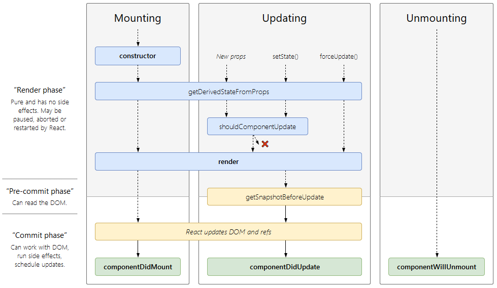

# React 高阶部分

## Props，State 和 render 函数的关系

每当Props，State 发生变化，render 函数会重新执行一次。

## 虚拟DOM

状态改变后，需要更新视图。

其耗费性能的操作：

- 生成DOM
- 替换DOM

方法一：生成后直接替换。

方法二：新的DOM与原始的DOM进行比较，替换改变后的元素。

方法三：生成虚拟DOM，状态变化后，生成新的虚拟DOM，比较虚拟DOM的区别，操作DOM，改变相应元素的内容。

原理：减少耗费性能的两个操作。JavaScript创建对象很简单，但是创建DOM性能消耗大。另外，比较虚拟DOM代价也比较低。

### Diff 算法

状态的改变与setState有关。

setState 是异步的，原因是，如果setState 在短时间内被操作，则会把比对过程进行合并。

## PropTypes 类型检查

`PropTypes` 可以确保你的组件收到的数据是经过验证的。考虑到性能，它只在开发环境被使用。

### PropTypes

```javascript
import PropTypes from 'props-types'
MyComponent.propTypes = {
  optionalString: PropTypes.string,
  optionalBool: PropTypes.bool,
  // ...
}
```

### 默认的 Prop 值

```javascript
import PropTypes from 'props-types'
Mycomponent.defaultProps = {
  name: 'Stranger'
}
```

### 单独子元素

`PropTypes.element` 可以确保只有一个子元素被传入。

```javascript
import PropTypes from 'props-types'
MyComponent.propTypes = {
  children: PropTypes.element.isRequired
};
```

## 组件的生命周期



生命周期函数是在不同时期，组件会自动执行的函数。

### 挂载

当组件实例被创建并插入DOM中时，其生命周期调用顺序如下：

- **constructor()**
- static getDerivedStateFromProps()
- **render()**
- **componentDidMount()**

### 更新

当组件的 props 或 state 发生变化时会触发更新。

- static getDerivedStateFromProps()
- shouldComponentUpdate()
- **render()**
- getSnapshotBeforeUpdate()
- **componentDidUpdate()**

### 卸载

当组件从DOM中移除时会调用如下方法：

- componentWillUnmount()

### 错误处理

当渲染过程，生命周期，或子组件的构造函数中抛出错误时，会调用如下方法：

- static getDerivedStateFromError()
- componetDidCatch()