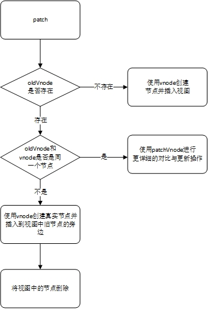

# patch

虚拟DOM最核心的部分是patch，它可以将vnode渲染成真实的DOM。

之所以要这么做，主要是因为DOM操作的执行速度远不如JavaScript的运算速度快。

## patch介绍

patch的目的其实是修改DOM节点（或理解为渲染视图），手段是对比两个vnode之间的差异。patch不是暴力替换节点，而是在现有DOM上进行修改来达到渲染视图的目的。对现有DOM进行修改需要做3件事：

- 创建新增的节点；
- 删除已经废弃的节点；
- 修改需要更新的节点。

接下来主要讨论在什么情况下创建新节点，插入到什么位置；在什么情况下删除节点，删除哪个节点；在什么情况下修改节点，修改哪个节点。

> 之所以需要通过算法对比两个节点的差异，并针对不同的节点进行更新，主要是为了性能考虑。

### 新增节点

- 首次渲染
- vnode和oldVode不是同一个节点

新增节点的一个很明显的场景就是，当oldVnode不存在而vnode存在时，就需要使用vnode生成真实的DOM元素并将其插入到视图当中去。

这通常会发生在首次渲染中。

除了上面这种情况需要新增节点之外，还有一种情况也需要新增节点。

当vnode和oldVnode完全不是同一个节点时，需要使用vnode生成真实的DOM元素并将其插入到当前视图当中。

### 删除节点

- 当一个节点只在oldVnode中存在时

当oldVnode和vnode完全不是同一个节点时，在DOM中需要使用vnode创建新节点替换oldVnode所对应的的旧节点，而**替换过程**是将新创建的DOM节点插入到旧节点的旁边，然后再讲旧节点删除，从而完成替换过程。

### 更新节点

除了前面介绍的场景。另一个更常见的场景是新旧两个节点时同一个节点。当新旧两个节点时相同的节点时，我们需要对这两个节点进行比较细致的对比，然后对oldNode在视图中所对应的的真实节点进行更新。

---

参考：深入浅出Vue.js