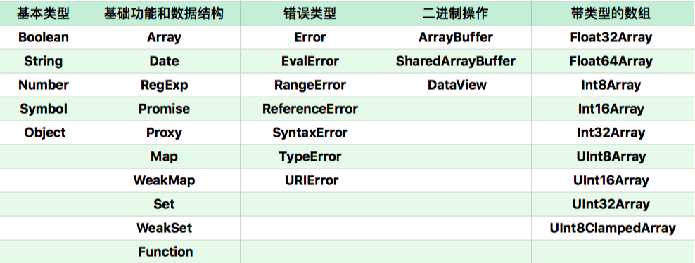

# JavaScript对象

## 对象分类

- 宿主对象：由JavaScript宿主环境提供的对象，它们的行为完全由宿主环境决定。
- 内置对象：由JavaScript语言提供的对象。
  - 固有对象（Intrinsic Objects）
  - 原生对象（Native Objects）
  - 普通对象（Ordinary Objects）

## 宿主对象

在浏览器中，全局对象是window。

## 固有对象

固有对象就是在任何JS代码运行前就已经被创建出来的，它们通常扮演着类似基础库的角色。

ECMA标准为我们提供了一份[固有对象表](https://www.ecma-international.org/ecma-262/9.0/index.html#sec-well-known-intrinsic-objects)，里面有150+固有对象。

## 原生对象

能够通过语言本身的构造器Array、RegExp等创建的对象称作原生对象。

几乎所有这些构造器的能力都是无法用纯JavaScript代码实现的，它们也无法用class/extend语法类继承。

图来自重学前端

## 普通对象

由{}语法、Object构造器或者class关键字定义类创建的对象，它们能够被原型继承。

---

来自：重学前端