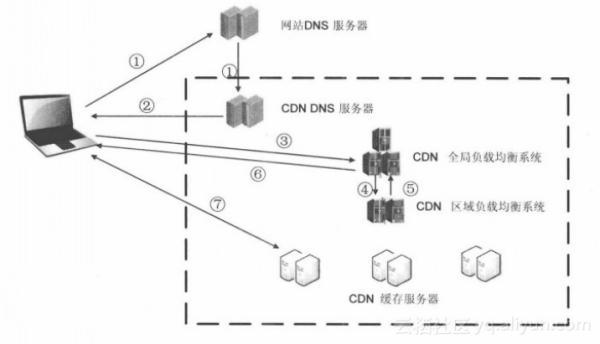

# CDN

## 基础架构

最简单的CDN网络由一个DNS服务器和几台缓存服务器组成：

- 当用户点击网页的URL，经过本地DNS系统解析，DNS系统会最终将域名的解析权交给CNAME指向的CDN专用DNS服务器；
- CDN的DNS服务器将CDN的全局负载均衡设备IP地址返回给用户；
- 用户向CDN的全局负载均衡设备发起内容URL访问请求；
- CND全局负载均衡设备根据用户IP，以及用户请求内容的URL，选择一台用户所属区域的区域负载均衡设备，告诉用户向这台设备发起请求。
- 区域负载均衡设备会为用户选择一台合适的缓存服务器提供服务，选择的依据包括：根据用户IP地址，判断哪一台服务器距用户最近；根据用户所请求的URL中携带的内容名称，判断哪一台服务器上有用户所需内容；查询各个服务器当前的负载情况，判断哪一台服务器有服务能力。基于以上分析后，区域负载均衡会向全局负载均衡设备返回一台缓存服务器的IP地址；
- 全局负载均衡设备把服务器的IP地址返回给用户；
- 用户向缓存服务器发起请求，缓存服务器响应用户请求，将用户所需美容传送到用户终端。如果这台缓存服务器上并没有用户想要的内容，而区域均衡设备依然将它分配给了用户，那么这台服务器就要向它的上一级缓存服务器请求内容，直至追溯到网站的源服务器将内容拉到本地。

## CDN使用场景

网站类型：访问量大的网站，如：在线视频，游戏，图片，音频，社交，电商，下载站等。

存储资源类型：一定量级的静态资源，如：html，js，css，apk，mp3，flv，jpg，mp4等。

## 计费相关

> 以下是阿里云计费模式，可能失效。

- 按流量小时结算：最低可达0.26元/GB；
- 按峰值带宽计费按日结算：最低可达0.76元/Mbps/日。

## 刷新限制

- 单条URL刷新生效时间在5分钟，每天最多刷新2000次；
- 目录刷新的生效时间大概在5分钟，每天支持100次目录刷新操作。

## 常见问题

1. CDN是对网站所在服务器还是域名加速？

答：域名。

2. 为何网站更新后，通过CDN看到的还是旧网页。

答：缓存没有更新。为了解决这个问题，CDN管理面板中提供了URL推送服务，来通知CDN各节点刷新自己的缓存。在URL推送地址栏中，输入具体的网址或图片地址，则各节点中的缓存内容被统一删除，并且当即生效。

---

来源：

[视界云](https://zhuanlan.zhihu.com/p/28939811)

[阿里云](http://docs-aliyun.cn-hangzhou.oss.aliyun-inc.com/pdf/cdn-FAQ-cn-zh-2016-08-17.pdf)