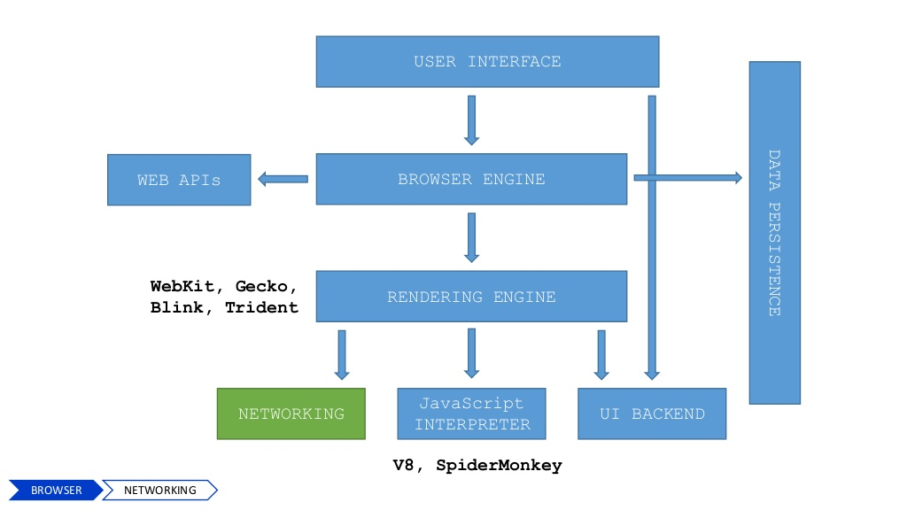

# 浏览器组成

1. 用户界面
2. 网络
3. JavaScript引擎
4. 渲染引擎（排版引擎）
5. UI后端
6. JavaScript解释器
7. 数据持久化存储

我们常说的浏览器内核主要指的是渲染引擎。

作为前端开发者，我们需要重点理解渲染引擎和数据存储。

下表是常见的浏览器内核：

| 内核    | 浏览器                                |
| ------- | ------------------------------------- |
| Trident | IE，360，搜狗                         |
| Gecko   | Netscape6以上版本，Firefox，SeaMonkey |
| Presto  | Opera7+                               |
| Webkit  | Safari，Chrome                        |
| Blink   | 较多的移动端浏览器                    |

