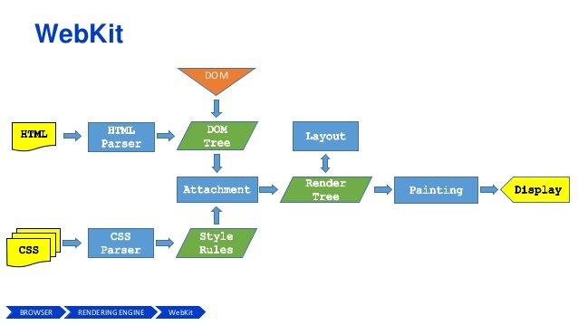

# 渲染

渲染引擎在浏览器中主要用于解析HTML文档和CSS文档，然后将CSS规则应用到HTML标签元素上，并将HTML渲染到浏览器窗口中以显示具体的DOM内容。

流程主要包括以下几个步骤：

- 解析HTML构建DOM树
- 构建渲染树
- 渲染树布局
- 绘制渲染树

渲染树布局：元素的布局属性生效（position、float、margin等）。

绘制渲染树：将渲染树节点的背景、颜色、文本等样式信息应用到每个节点上，这个阶段主要是元素的内部显示样式。（color、background、text-shadow等）

从上图也可以看出来，CSS树和DOM树是并行处理的。由于JavaScript可能会对DOM和样式进行操作，所以样式会在后面JavaScript执行前先加载执行完毕。

注意：

- CSS加载会阻塞DOM树的渲染，但不阻塞解析；
- CSS加载会阻塞后面JavaScript语句的执行。